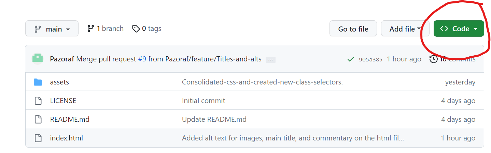
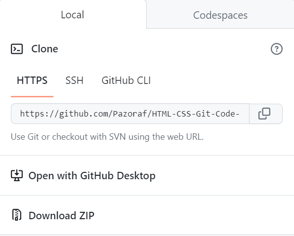
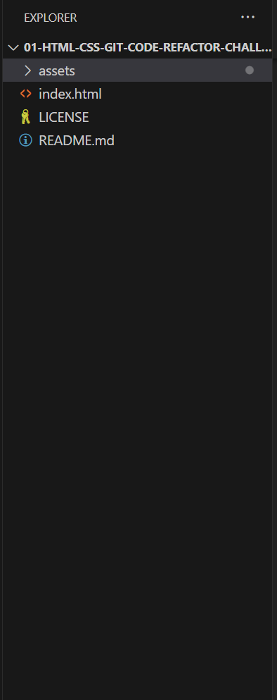

# HTML-CSS-Git-Code-Refractor-Challenge-

## Description 
Refactor Challenge in HTML and CSS.
The purpose of this project was to refactor existing code provided to be by a marketing agency. The agency hired me to refactor an existing website to make it more **accessible**, to help people with disabilities and to also improve the websites position in search engines.
My aim during this project was to improve accessibility by including semantic elements and selectors instead of generic div containers, to apply accesible alt attributes to images and icons and to apply a concise and descriptive title. I also employed the **Scout Rule** during my work, and tried to tidy and clean the code to the best of my ability. I did this by ensuring the HTML elements follow a logical structure, and by ensuring that selectors within the style sheet fell in sequential order in relation to the html file. I also included comment annotations throughout the code to display any changes I have made and explain my reasoning.
Ultimately there was no visual change to the webpage, as that was not my goal and not what I was hired for, instead the changes I have made go on behind the scenes, and have improved accessibility for search engine optimisation and functionality with screen readers.

The site is deployed at: 
(https://pazoraf.github.io/HTML-CSS-Git-Code-Refactor-Challenge/)

```md

```
## Installation

1. Navigate to code button on the github repository.
```md

```
2. Download repository via your preffered means.
```md

```
3. Open repository in VSS or similar editor.
```md

```

## Usage 

There are two methods to use the project
### Usage method 1
1. In VSS, or similar editor, open the repository as instructed in the installation steps.
2. Navigate to index.html to view the HTML code.
```md

```
3. Navigate to style.css inside assets/css to view the CSS code.
```md

```
### Usage method 2
1. Open the deployed website at (https://pazoraf.github.io/HTML-CSS-Git-Code-Refactor-Challenge/) in google chrome.
2. Right click anywhere on the page and select inspect.
```md

```
3. Use the developer tools to inspect both the HTML and CSS.
```md

```

## Credits

Resources: (https://www.w3schools.com/html/html5_semantic_elements.asp)


## License