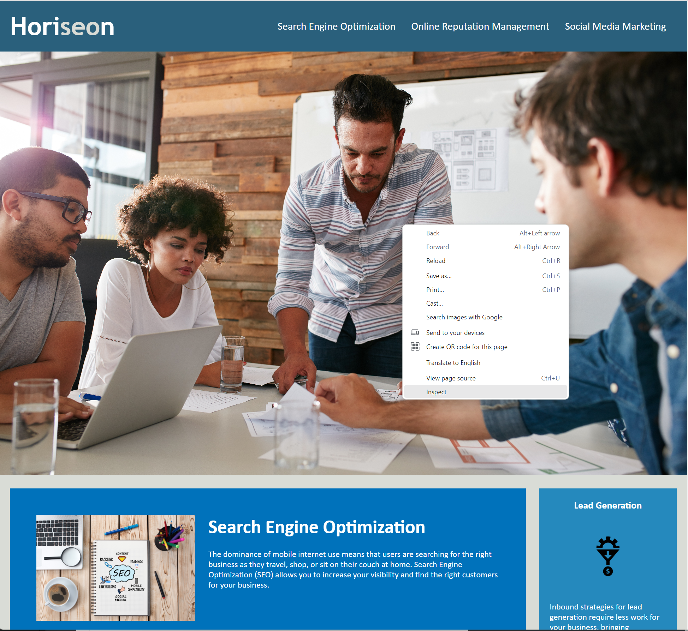

# HTML-CSS-Git-Code-Refractor-Challenge-

## Description
Refactor Challenge in HTML and CSS.
The purpose of this project was to refactor existing code provided to me by a marketing agency. The agency hired me to refactor an existing website to make it more **accessible**, to help people with disabilities, and to also improve the website's position in search engine results.
My aim during this project was to improve accessibility by including semantic elements and selectors instead of generic div containers, applying accessible alt attributes to images and icons, and applying a concise and descriptive title. I also employed the **Scout Rule** during my work and tried to tidy and clean the code to the best of my ability. I did this by ensuring the HTML elements follow a logical structure and by ensuring that selectors within the style sheet fell in sequential order in relation to the HTML file. I also included comment annotations throughout the code to display any changes I have made and explain my reasoning.
Ultimately, there was no visual change to the webpage, as that was not my goal and not what I was hired for; instead, the changes I have made go on behind the scenes and have improved accessibility for search engine optimisation and functionality with screen readers.

The site is deployed [here.](https://pazoraf.github.io/HTML-CSS-Git-Code-Refactor-Challenge/)

## Installation

1. Navigate to the code button on the GitHub repository.

2. Download the repository via your preferred means.

3. Open a repository in VSS or a similar editor.

## Usage

There are two methods to use the project.
### Usage Method 1
1. In VSS or a similar editor, open the repository as instructed in the installation steps.
2. Navigate to index.html to view the HTML code.

3. Navigate to style.css inside assets/css to view the CSS code.

### Usage Method 2
1. Open the deployed website at (https://pazoraf.github.io/HTML-CSS-Git-Code-Refactor-Challenge/) in Google Chrome.
2. Right-click anywhere on the page and select inspect.

3. Use the developer tools to inspect both the HTML and CSS.

## Credits

Resources:
- [W3Schools Semantic Elements](https://www.w3schools.com/html/html5_semantic_elements.asp)
- [w3Schools Accesibility Tutorial](https://www.w3schools.com/accessibility/index.php)
- [W3Schools img alt Attribute](https://www.w3schools.com/tags/att_img_alt.asp)
- [CanAdapt Alternate Text for Background Images](https://www.davidmacd.com/blog/alternate-text-for-css-background-images.html)
- [Markdown Syntax](https://www.markdownguide.org/basic-syntax/#links)

## License
Copyright (c) 2023 Alexander Flaherty.

Licensed under the [MIT](LICENSE.txt) license.